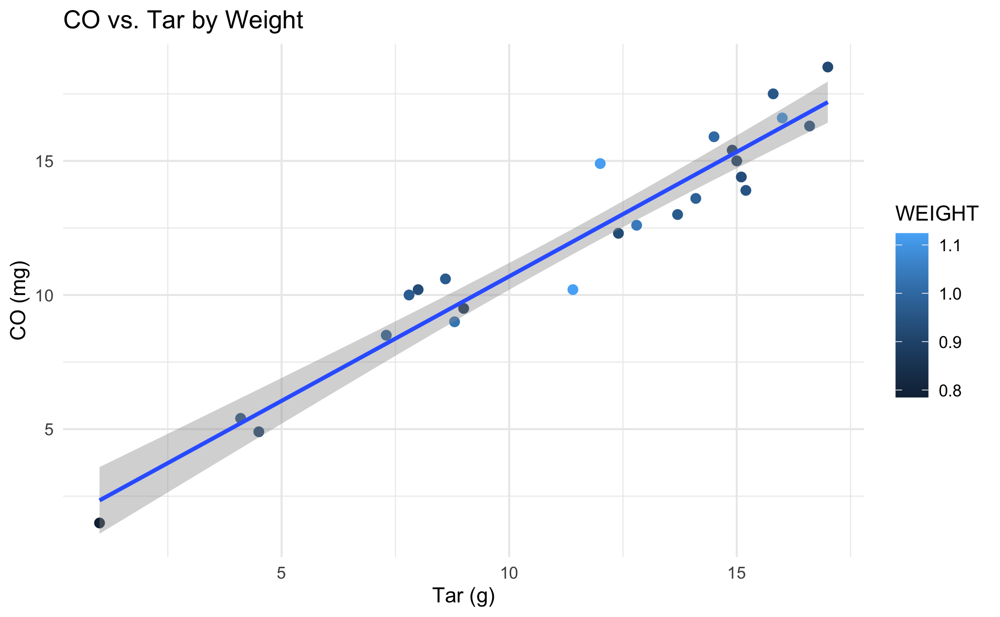
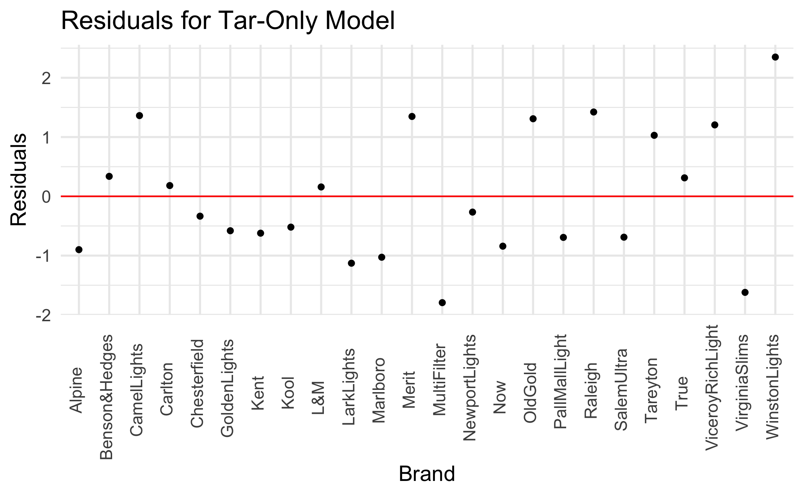
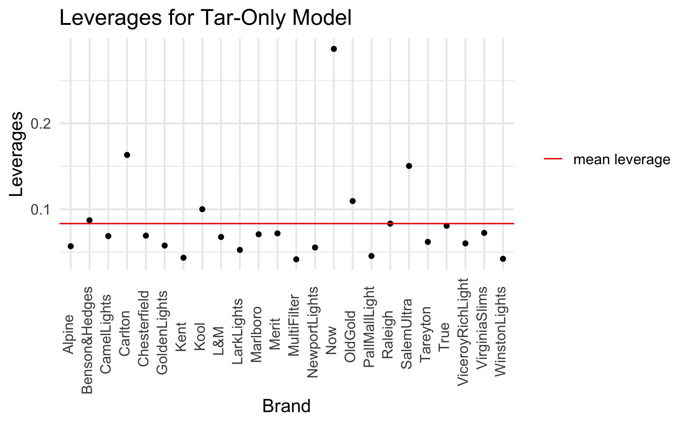
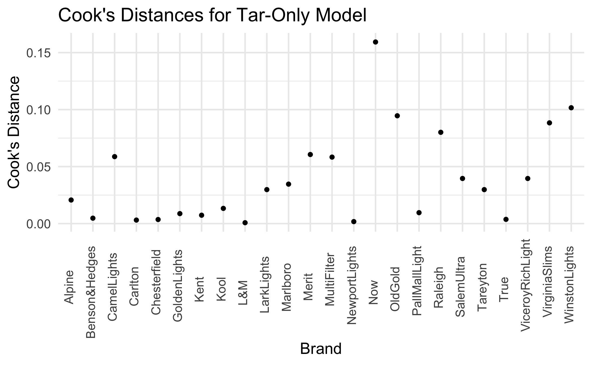

<!-- This is the README for the STAT288 cigarette project repository -->

# STAT 288 Multivariable Multiple Regression

## Data are from the Federal Trade Commission ratings of cigarettes for tar, CO, and nicotine content (year unknown)

The goal of this assignment was to provide a statistical analysis of the cigarette data for a stakeholder, such as the U.S. Surgeon General or another party interested in predicting quantities of chemicals in second hand smoke.  We were supposed to obtain what we felt was the best model predicting carbon monoxide yield based on tar, nicotine, and cigarette weight.

The data consist of individual cigarettes representing 25 brands that were analyzed for their weight, tar, nicotine, and CO yield.  One sample is an outlier, the Bull Durham sample.  This cigarette  accounts for all maximum values shown in the table of descriptive statistics, and for reasons discussed below, the Bull Durham sample was excluded from our analyses. 

## Descriptive Statistics

|        | Tar (g) | Nicotine (g) | Weight (g) | CO (mg)
---------|---------|--------------|------------|--------
 **Min** | 1.00 | 0.13 | 0.79 | 1.50
 **Mean** | 12.22 | 0.88 | 0.97 | 12.53
 **Std Dev** | 5.67 | 0.35 | 0.09 | 4.74
 **Max** | 29.80 | 2.03 | 1.17 | 23.50

## Linear Models for CO yield

We examined models predicting CO yield based on tar, nicotine, and weight, as well as models including interaction terms for tar:weight and separately nicotine:weight, along with their respective main effects. The Bull Durham sample, an obvious outlier among the data, excessively directs the fit of linear models. Its leverage, at 0.51, is highly influential, exceeding twice the mean leverage, the typical boundary for identifying outliers in the X direction.  The Cook’s distance for this sample is 2.1, roughly 4 times the accepted value of 0.5 for identifying outliers in the Y direction. With the omission of the Bull Durham sample there are no interaction terms that significantly affect the slope of the regression line for any model examined. In contrast, models that include this sample show a significant interaction between tar and weight, although the correlations of tar and nicotine with CO yield are unaffected. Given such a strong effect of this single sample, we do not believe it would be wise to base predictions of CO yield on data with this sample. Accordingly, the Bull Durham sample was excluded from our analysis.

## Correlation of Predictors and the Problem of Collinearity

The correlation between tar and nicotine is 0.96 and that between tar and CO is 0.97. Therefore, tar and nicotine are associated, as are tar and CO, as if tar is the progenitor of both nicotine and CO, or these chemicals are all derived from the same source. The correlation between nicotine and CO is 0.93, however, this relationship is distorted by the association between tar and nicotine.  The partial correlation between tar and CO whjile controlling for nicotine is reduced to 0.71, but the partial correlation between nicotine and CO while controlling for tar is reduced much more to 0.04.  Thus, there is no association between nicotine and CO in the absence of the association between nicotine and tar.  For these reasons, tar should be the variable of interest when it comes to predicting a cigarette's CO yield.  Furthermore, in the model including tar, weight, and nicotine, the only significant predictor of CO yield is tar.

Collinearity of predictor variables is evident based on the variance inflation factors (VIFs). In the model with all three predictors, weight has a neutral VIF of 1.09, but tar and nicotine show very strong collinearity with VIFs of 12.74 and 12.76, respectively. This reflects the strong correlation between tar and nicotine mentioned above. In the model with both weight and tar, the VIF of tar is 137.67 and that for the interaction term tar:weight is 158.86.  Weight in this model including tar has a VIF of 7.10.  These metrics imply that a heavier cigarette has more tar and it is the tar that accounts for that cigarette's CO yield.

## The Most Parsimonious Model

CO = 1.4128 + 0.9281(Tar)  
R2 = 0.9335  
F statistic = 308.6 on 1 and 22 DF (p-value: 1.964 x 10-14)  

The model with tar as the sole predictor is the best model.  Including nicotine, the only other significant predictor when present alone, plus the interaction term tar:nicotine raises the R2 by 1.1% to 0.9342.  Given the absence of any real improvement in the model's accuracy and the strong correlation between tar and nicotine, it is unclear that nicotine is independently predicting CO yield in this more complicated model.  Thus, we favor the simplest but effective model with tar as the only predictor of CO yield.
  
